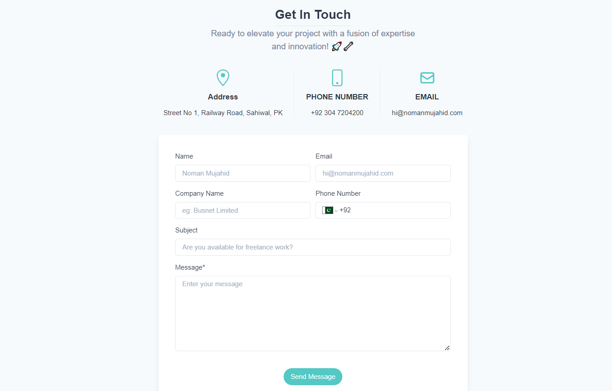
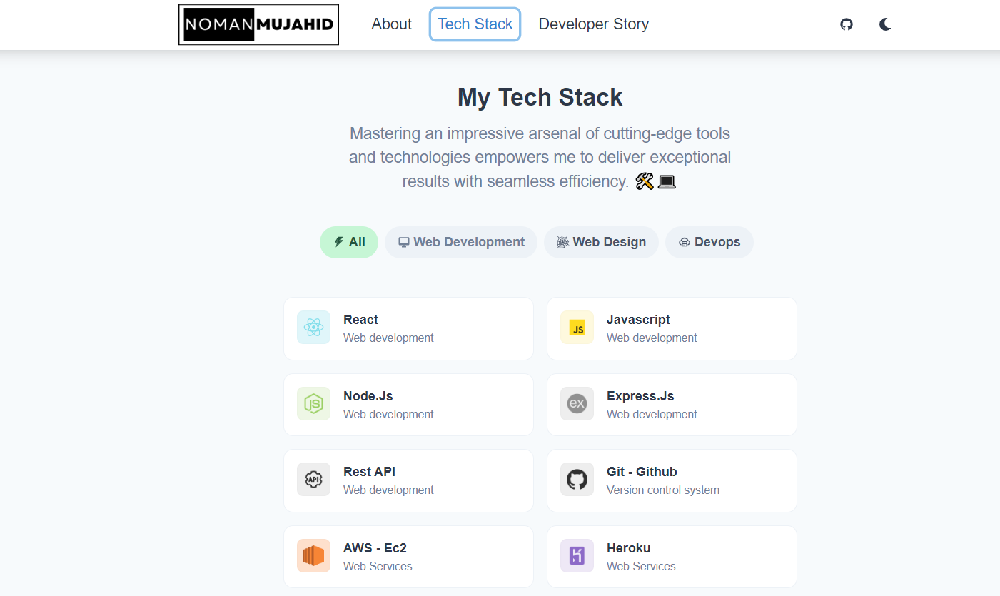

This is the source for my personal website [aliwahid](https://Aliwahid.site).

## Built with
- [Typescript](https://www.typescriptlang.org/)
- [Reactjs](https://reactjs.org/)
- [Chakra UI](https://chakra-ui.com)
- [Framer Motion](https://www.framer.com/motion/)
- [react icons](https://react-icons.github.io/react-icons/)

## Screens

## License

Licensed under the MIT License. Feel free to use parts of the code in your own projects with attribution!
